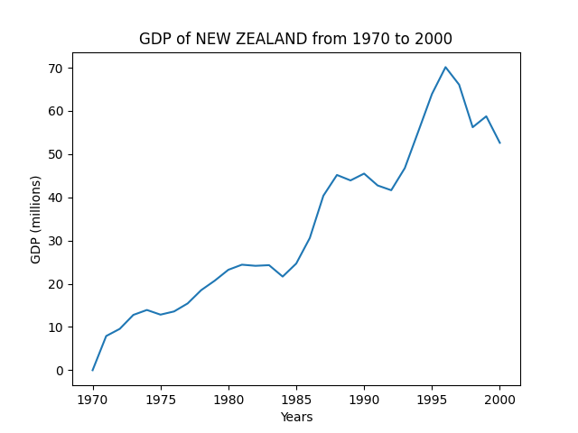

The Python script `plotCountryGDP.py` will make a plot of a given country's GDP over a given range of years.  

To use it, you use the following syntax:

    python plotCountryGDP.py api_key country_name beginning_year ending_year

If the country name has spaces in it, it must be enclosed in double quotes.  The api key and country name are required, but the years are optional.  When no years are given, all the available GDP data will be plotted.  When only one year is given, the plot will show all the data up to and including the given year.  

Here are a few examples:

    python plotCountryGDP.py api_key mexico

    python plotCountryGDP.py api_key "new zealand" 1970 2000

    python plotCountryGDP.py api_key sweden 2000

